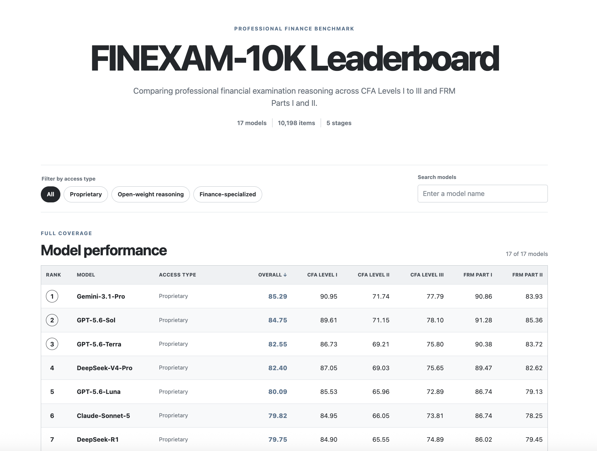
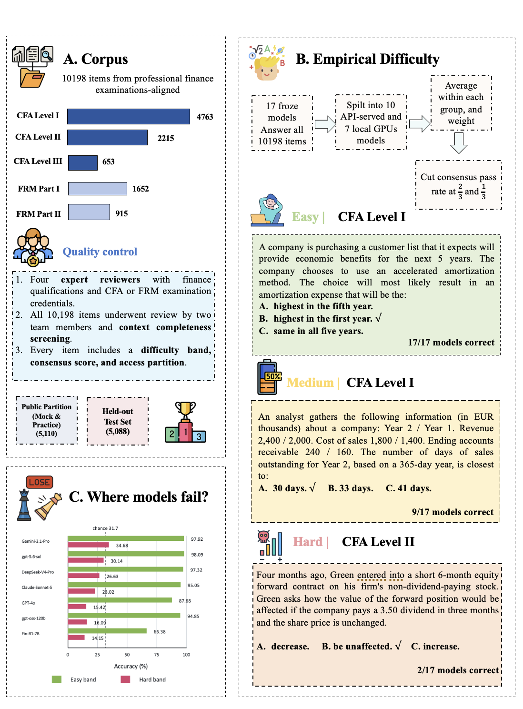

# FinExam-10K: When Retrieval Helps Financial Reasoning?

FinExam-10K is a benchmark for professional financial examination reasoning across CFA Levels I to
III and FRM Parts I and II. It contains 10,198 expert-reannotated multiple-choice items, a frozen
17-model evaluation panel, and controlled retrieval and routing experiments. This repository
releases the 5,110-item public partition, aggregate held-out results, frozen selectors, public
reproduction code, Figure 1, tests, and an offline leaderboard.

[Open the offline leaderboard](docs/index.html)

[](docs/index.html)

## Results at a Glance

The Full-Coverage Track evaluates all 10,198 items. The 17-model leaderboard ranges from 51.53% to
85.29% overall accuracy. Even the leader reaches only 34.68% on its leave-one-model-out Hard band.
The Context-Complete Reasoning Track shows that missing parent evidence amplifies the collapse but
does not fully explain it.

| Model | Evaluation category | Full coverage accuracy (%) |
|---|---|---:|
| Gemini-3.1-Pro | Proprietary API served | 85.29 |
| GPT-5.6-Sol | Proprietary API served | 84.75 |
| GPT-5.6-Terra | Proprietary API served | 82.55 |
| DeepSeek-V4-Pro | Proprietary API served | 82.40 |
| GPT-5.6-Luna | Proprietary API served | 80.09 |
| Claude-Sonnet-5 | Proprietary API served | 79.82 |
| DeepSeek-R1 | Proprietary API served | 79.75 |
| GPT-OSS-120B | Open weight reasoning | 75.76 |
| Qwen3.7-Max | Proprietary API served | 74.74 |
| GPT-5.5 | Proprietary API served | 73.85 |
| GPT-OSS-20B | Open weight reasoning | 70.06 |
| GPT-4o | Proprietary API served | 69.15 |
| ODA-Fin-RL-8B | Finance specialized | 68.07 |
| Fin-O1-14B | Finance specialized | 65.79 |
| DianJin-R1-32B | Finance specialized | 64.93 |
| Hawkish-8B | Finance specialized | 52.25 |
| Fin-R1-7B | Finance specialized | 51.53 |

Static function augmentation creates many repairs and regressions. On the Full-Coverage Track,
neither Function-RAG nor FunctionGraph-RAG produces a reliable aggregate gain over Direct. The
verifier recovers part of the Program-of-Thought loss but remains below Direct.

| Reasoning chain | Condition | Accuracy (%) | Rescue | Harm | Change (points) |
|---|---|---:|---:|---:|---:|
| DeepSeek-R1 Chain-of-Thought | Direct | 79.75 | - | - | - |
| DeepSeek-R1 Chain-of-Thought | Function-RAG | 79.43 | 505 | 538 | -0.32 |
| DeepSeek-R1 Chain-of-Thought | FunctionGraph-RAG | 79.84 | 509 | 500 | +0.09 |
| GPT-4o Program-of-Thought | Direct | 69.37 | - | - | - |
| GPT-4o Program-of-Thought | Function-RAG | 68.09 | 427 | 557 | -1.27 |
| GPT-4o Program-of-Thought | FunctionGraph-RAG | 68.06 | 527 | 660 | -1.30 |
| GPT-4o Program-of-Thought | FunctionGraph-RAG + Verifier | 68.92 | 484 | 530 | -0.45 |

The Selective Branch Router is a limited positive result, trained and thresholded only on public data, then frozen.
It selects FunctionGraph-RAG for 404 of 5,088 held-out items and improves accuracy from 70.83% to 71.23%.
On the 4,219-item held-out context-complete subset, it improves from 78.34% to 78.88%. This modest
one-step result, with 55 rescues and 35 harms overall, is not evidence for a general multi-step agent.

## Dataset

### Construction and expert reannotation

FinExam-10K contains 10,198 English multiple-choice items across all five stages. Every retained
item passed rationale filtering, normalization, global deduplication, two-stage expert
reannotation, and deterministic quality assurance for schema validity, identifier uniqueness,
answer-option mapping, and content duplication.

A four-member finance-qualified team reviewed all items. Stage-matched reviewers checked and
revised the question, options, gold answer, source rationale, stage, available subject label, and
metadata. A complete second pass integrated corrections before the response matrix and difficulty
labels were frozen.

The public and held-out partitions received the same cleaning, expert reannotation, quality
assurance, answer extraction, and scoring protocol before access partitioning.

### Access partitions

The full benchmark has 10,198 items. Its public partition contains 5,110 Mock and Practice Exam
records in item-level JSON, JSONL, CSV, and XLSX. The other 5,088 items are held out, with only
aggregate results and manifests released. No held-out question text, options, answers, rationales,
predictions, or per-item routing decisions are exposed here.

### Empirical difficulty and diagnostic subsets

Empirical difficulty uses one frozen prediction per model on all 10,198 items. The panel has 10
API-served and 7 locally evaluated models. Correctness is averaged within each access group and the
two means receive equal weight. Easy requires consensus at or above 2/3, Hard at or below 1/3, and
all other items are Medium.

| View | Items | Definition |
|---|---:|---|
| Easy band | 6,578 | Group-balanced consensus at or above 2/3 |
| Medium band | 2,183 | Group-balanced consensus between 1/3 and 2/3 |
| Hard band | 1,437 | Group-balanced consensus at or below 1/3 |
| Context-Complete Reasoning Track | 7,625 | Fixed filter for locally available answer evidence |
| Context-Complete Hard diagnostic | 372 | Intersection of the Context-Complete filter and Hard band |
| Universal Failure Core | 188 | Items missed by every model in the frozen 17-model panel |

Easy, Medium, and Hard partition the full benchmark. The other three rows are nested analytical
views, not additional bands. The Context-Complete track inherits the frozen labels. The 372-item
diagnostic is its Hard intersection. The 188-item universal failure core is a model-outcome
diagnostic inside Hard, and 47 of those items are context complete.

### Context completeness

Every record is a locally complete multiple-choice record with a question, options, gold answer,
and rationale. Context incomplete does not mean malformed JSON or a missing core field. Item-level
separation may have detached evidence from a shared parent vignette, table, image, figure, or
exhibit. Full Coverage preserves all 10,198 records. Supplied-evidence claims rely primarily on the
7,625-item Context-Complete Reasoning Track.

### Public downloads

Primary releases include the [canonical 5,110-item JSON](data/public/finexam10k_public_5110_canonical.json),
[JSONL](data/public/finexam10k_public_5110_canonical.jsonl),
[CSV](data/public/finexam10k_public_5110_table.csv), and
[XLSX workbook](data/public/finexam10k_public_5110.xlsx). See the
[data dictionary](data/public/data_dictionary.csv) and [export manifest](data/public/public_export_manifest.json).

Public diagnostics include the [context completeness audit](data/context_completeness_public.json),
[difficulty labels](data/difficulty_labels_public_5110.json),
[Context-Complete Hard extract](data/diagnostic_context_complete_hard.json), and
[Universal Failure Core extract](data/diagnostic_zero_solve.json). The extracts contain 138 of 372
and 118 of 188 public members, respectively. Aggregate files cover
[RAG](data/aggregates/rq2_results.json), [the gate](data/aggregates/gate_results.json), and
[bounded agentic probes](data/aggregates/agentic_probes.json).

These extracts are access-limited views, not random samples, and do not replace full-diagnostic results.

## Evaluation Framework and Interventions

Matched conditions keep the item, backbone, decoding, answer extraction, and scoring fixed. A
rescue changes an incorrect Direct answer to correct. A harm changes a correct Direct answer to
incorrect.

### Direct

Direct answers the supplied item without external function retrieval. It is the reference answer
path for all rescue and harm comparisons.

### Function-RAG

Function-RAG is the FinanceReasoning-style reference condition. The implementation follows its
formulation and chain-specific retrieval setup rather than claiming an exact reproduction. GPT-4o
Program-of-Thought uses a generated query, Contriever top-30 retrieval, and an LLM judge retaining
zero to three functions. DeepSeek-R1 Chain-of-Thought uses BM25 top-30 followed by transferred
instructed retrieval and judging.

### FunctionGraph-RAG

FunctionGraph-RAG is the learned graph-based extension. The two reasoning chains use separate
frozen selectors because their retrieval and graph constructions differ.

- GPT-4o Program-of-Thought expands Contriever top-30 candidates by one hop over shared article title
  and four-nearest-neighbor edges. A 4-feature ranker trained on 511 reachable Easy and Medium labels returns at most 3 functions.
- DeepSeek-R1 Chain-of-Thought expands BM25 top-30 candidates up to two hops over shared normalized
  input or output quantities, capped at 80. A 56-feature reranker trained on 890 reachable Easy, Medium, and Hard labels returns 10.

Both selectors transfer out of distribution from FinanceReasoning to FinExam-10K. Training uses no
FinExam-10K item, answer, rationale, correctness signal, or model output, and performs no
FinExam-10K adaptation.

### FunctionGraph-RAG + Verifier

For GPT-4o Program-of-Thought, the verifier runs when Function-RAG and FunctionGraph-RAG disagree.
It observes the item, options, both programs or traces, and both execution results, then selects one
frozen branch answer. This is bounded answer verification, not iterative repair.

### Selective Branch Router

The Selective Branch Router runs Direct, then chooses between Direct and FunctionGraph-RAG. Its 27
observable inference-time features cover item form, Direct parsing and execution, token and latency
summaries, errors, and the Direct option. It excludes gold correctness, rationales, retrieval state,
FunctionGraph-RAG output, and cross-branch features.

Five-fold public cross-validation selects logistic regression with `C = 0.5` and threshold `0.68`.
Training and threshold selection use only the 5,110 public items. The policy is frozen before
held-out evaluation. Evaluation uses frozen branch outputs, while the feature contract supports
lazy execution after a trigger.

### Bounded agentic probes

The paper also reports fixed-budget probes, not a learned multi-step agent. Same-backbone
verification changes accuracy by +0.27 points and plan-then-solve by -3.33 points. Answerability
detection rejects 53.3% of answerable items. These limited or negative findings motivate future work.

## Quick Start

Python 3.11 or 3.12 is required. Install pinned dependencies from the repository root.

```bash
python -m pip install -r requirements.txt
```

Load the canonical public JSON:

```python
import json
from pathlib import Path

payload = json.loads(
    Path("data/public/finexam10k_public_5110_canonical.json").read_text()
)
records = payload["records_data"]
print(len(records))
```

## Reproduce Public Analyses

Public reproduction uses released records, frozen predictions, selectors, and aggregates. It does
not rerun model inference or reconstruct held-out items.

```bash
python code/public_reproduce.py
```

Run the full package checks:

```bash
./run_tests.sh
```

See [reproducibility notes](docs/REPRODUCIBILITY.md) for component commands and the compute boundary.

## Offline Leaderboard

The leaderboard uses only included relative assets. Open [docs/index.html](docs/index.html)
directly, or serve the repository locally:

```bash
python -m http.server 8000
```

Then open `http://127.0.0.1:8000/docs/`. The stable root entry point is
[leaderboard.html](leaderboard.html).

## Repository Structure

```text
data/public/       Public JSON, JSONL, CSV, XLSX, summaries, and data dictionary
data/aggregates/   Aggregate intervention, gate, and bounded-probe results
data/router/       Frozen gate, public folds, and aggregate held-out manifest
data/selector/     Frozen Program-of-Thought and Chain-of-Thought selectors
code/              Public analysis, export, router, selector, table, and figure code
docs/              Offline leaderboard, Figure 1, preview, and reproduction notes
tests/             Requirement-driven data, method, site, and reproduction checks
```

## Evaluation Boundary and Intended Use

The package supports public-data analysis and aggregate verification. Held-out item-level
evaluation cannot be reproduced because questions and predictions are sequestered. Gate efficiency
is an implied branch-call count, not measured latency, token use, monetary cost, or energy.

FinExam-10K supports research on financial reasoning, evaluation, retrieval, verification, and tool
use. It is not financial advice, a substitute for certification, or evidence that a model is safe
for autonomous investment, risk management, compliance, or advisory use.

## Licensing

Code under `code/` is released under the MIT License. The public dataset is provided for
noncommercial research use under the terms in [LICENSE.md](LICENSE.md). Official CFA Institute and
GARP examination content is excluded. CFA Institute and GARP do not endorse this work.

## Figure 1



## Citation

Citation metadata will be added after publication. Use this neutral placeholder until then:

```bibtex
@misc{finexam10k,
  title = {FinExam-10K: When Retrieval Helps Financial Reasoning?},
  note = {Citation metadata pending}
}
```
