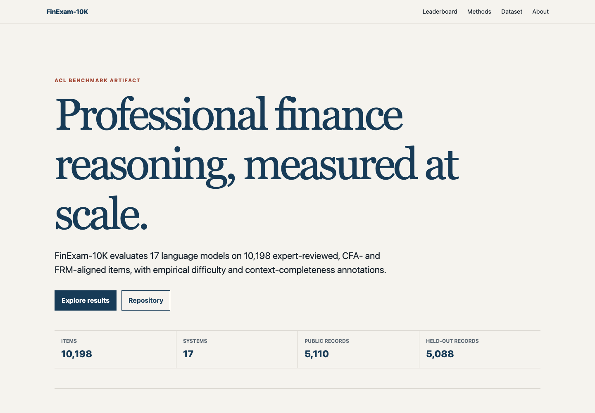

# FinExam-10K

FinExam-10K is an academic benchmark for professional financial reasoning. It contains 10,198
expert-reviewed, CFA- and FRM-aligned multiple-choice items and evaluates 17 language models across
full-coverage, context-complete, and empirical-difficulty views.

[Open the interactive leaderboard](https://yanlin-quinne.github.io/FinExam10k/)

[](https://yanlin-quinne.github.io/FinExam10k/)

## Figure 1: benchmark overview


Figure 1 summarizes the corpus composition, expert review and public/held-out split, frozen
17-model difficulty construction, and the benchmark views used to study model failures.

## Public dataset

The repository releases 5,110 mock and practice records. The 5,088 held-out records remain
sequestered for controlled evaluation.

- [JSON](data/public/finexam10k_public_5110_canonical.json)
- [JSONL](data/public/finexam10k_public_5110_canonical.jsonl)
- [CSV](data/public/finexam10k_public_5110_table.csv)
- [XLSX](data/public/finexam10k_public_5110.xlsx)

Field definitions are in [the data dictionary](data/public/data_dictionary.csv).

## Contribution

FinExam-10K separates two questions that are often conflated: whether an item is answerable from its
local evidence, and whether a model can reason correctly when that evidence is complete. The
benchmark contains 7,625 context-complete items, a frozen 1,437-item Hard band, and diagnostic
subsets for context-complete hard cases and universal model failures.

The paper also tests whether function retrieval mechanisms learned on BUPT FinanceReasoning
transfer to professional examination questions. The frozen retrieval structures and selectors are
not trained on FinExam-10K. FinExam-10K supplies a distinct evaluation distribution and a public
partition for selecting a lightweight routing policy.

Selected aggregate results:

| Evaluation | Direct | Intervention | Change |
|---|---:|---:|---:|
| DeepSeek-R1 CoT, full coverage, FunctionGraph-RAG | 79.75 | 79.84 | +0.09 points |
| GPT-4o PoT, full coverage, FunctionGraph-RAG | 69.37 | 68.06 | −1.30 points |
| GPT-4o PoT, full coverage, FunctionGraph-RAG + Verifier | 69.37 | 68.92 | −0.45 points |
| Selective Branch Router, held out | 70.83 | 71.23 | +0.39 points |
| Selective Branch Router, held-out context complete | 78.34 | 78.88 | +0.55 points |

The held-out Router invoked FunctionGraph-RAG on 404 of 5,088 items, with 55 rescues and 35 harms.

## Methods

- **Direct** answers from the supplied item without function retrieval.
- **Function-RAG** retrieves individual FinanceReasoning functions as structured support.
- **FunctionGraph-RAG** expands retrieval through relations between functions before selection.
- **FunctionGraph-RAG + Verifier** applies the PoT branch and then checks its execution before
  finalizing the answer.
- **Selective Branch Router** is a frozen public-trained pre-execution gate applied after Direct and
  before retrieval branch execution. Its 27 features use the item and completed Direct output. It
  does not observe the gold answer, retrieval outcome, or competing branch result.

For GPT-4o PoT, the transferred selector uses Contriever top-30 retrieval, one-hop expansion, four
features, 511 FinanceReasoning labels, and at most three functions. For DeepSeek-R1 CoT, it uses
BM25 top-30 retrieval, a quantity-relation function graph, 56 features, 890 labels, and at most ten
functions. These frozen components test transfer; they do not adapt on FinExam-10K evaluation
items.

## Reproduction

Python 3.11 is required. No GPU or network access is needed because public reproduction uses frozen
predictions.

```bash
python -m pip install -r requirements.txt
python code/public_reproduce.py
./run_tests.sh
```

See [the reproducibility notes](docs/REPRODUCIBILITY.md) for component commands and scope.

## Citation

An archival citation will be added after paper acceptance. During review, cite the accompanying
submission, *FinExam-10K: When Retrieval Helps Financial Reasoning?*
